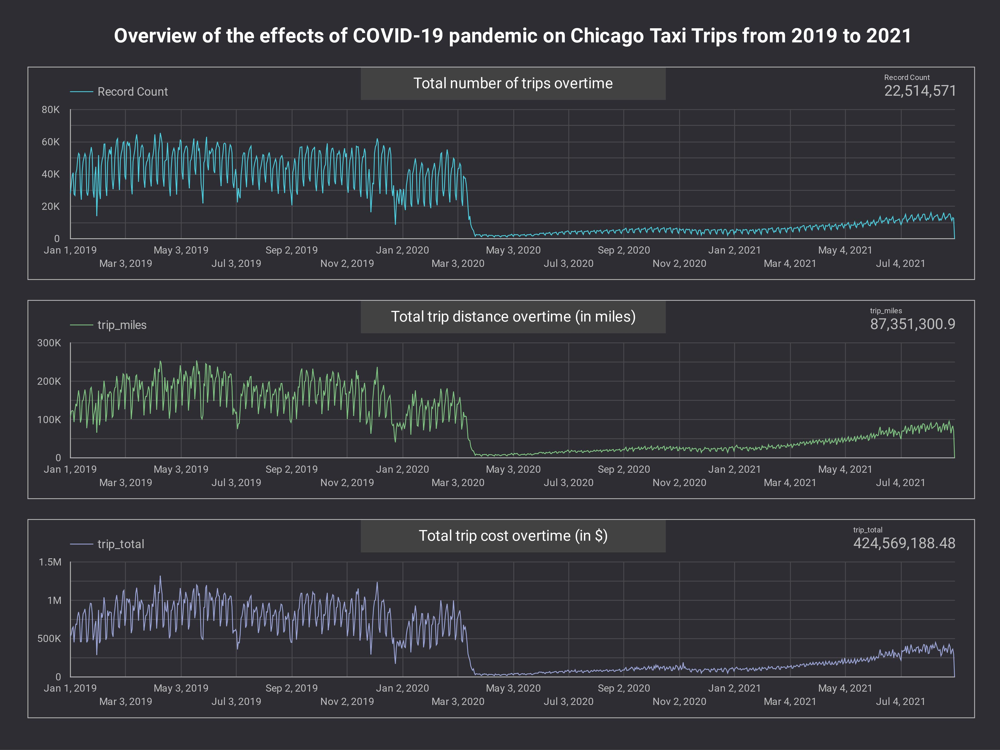
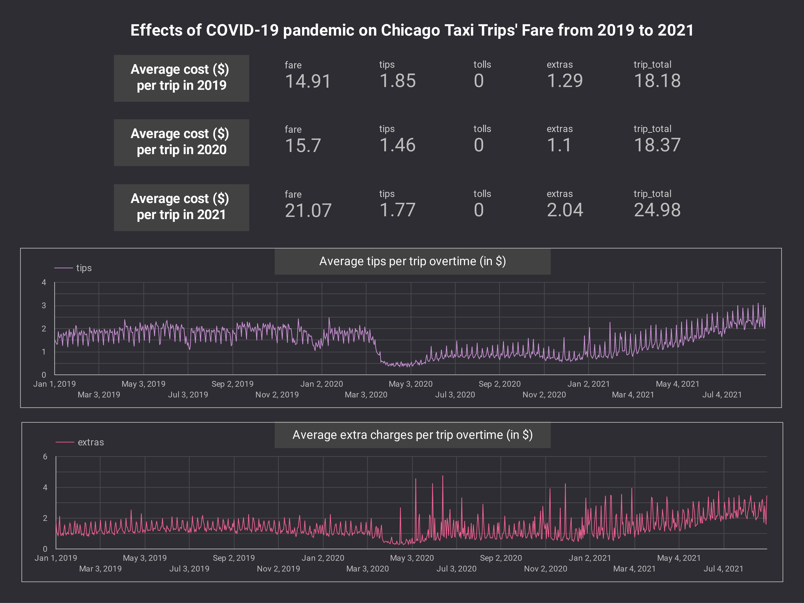
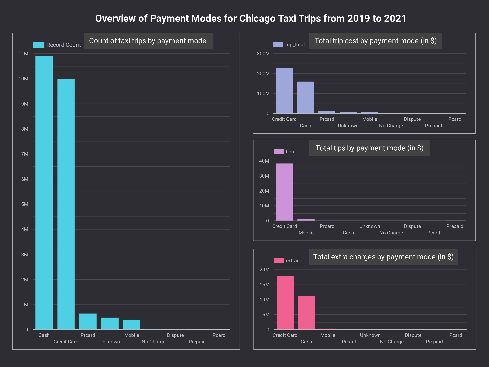
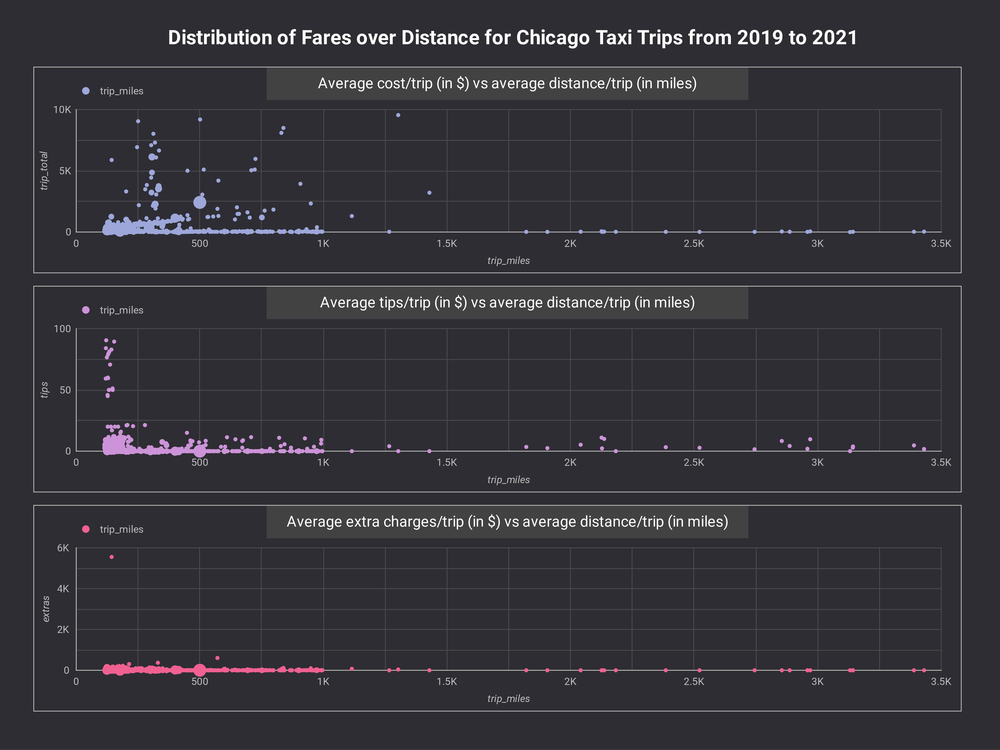

# Chicago Taxi Trips Visualization

##### By: Catherine Ang

---

### Background
With the growing presence of ridesharing companies such as Uber and Lyft in the city of Chicago, Illinois, United States of America, it has become inevitable that the taxi industry is suffering a hit (source: [Hush, May 2021](https://www.nbcchicago.com/news/local/chicago-taxi-industry-hit-hard-amid-pandemic-ride-share-trip-increases/2502335/)). Coupled with the COVID-19 pandemic, this has severely reduced the demand for taxi trips, with more people choosing to stay home (and avoiding the need to head out), thereby affecting the livelihood of taxi drivers. 

### Problem Statement
This project aims to leverage on the Chicago Taxi Trip public dataset from Google BigQuery for trips in 2019 to 2021, to address the following issues:
* How has the demand for taxi trips changed before and during the pandemic? 
* How has the pandemic influenced the passengers' choice of tips?
* Are there any discrepancies in the costs/payment modes of the taxi trips? 

### Contents
The key visualizations can be viewed on Google Data Studio: 
https://datastudio.google.com/reporting/a6a213a2-b62e-4cb8-b02e-2b2de2f4fa56 

### Datasets
Source: [Chicago Taxi Trip public dataset from Google BigQuery](https://console.cloud.google.com/bigquery?p=bigquery-public-data&d=chicago_taxi_trips&page=dataset) - prepared using Google BigQuery